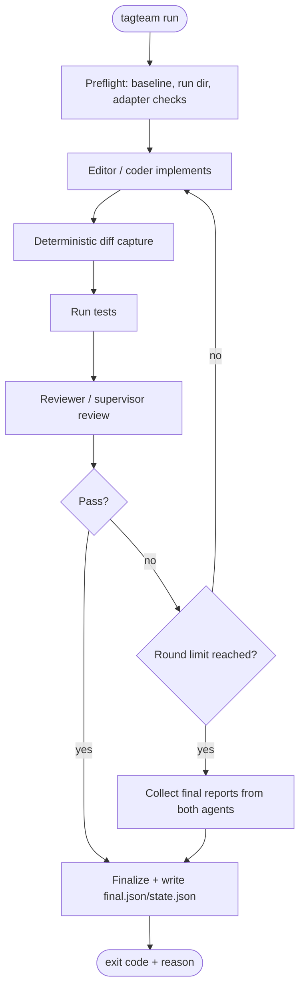
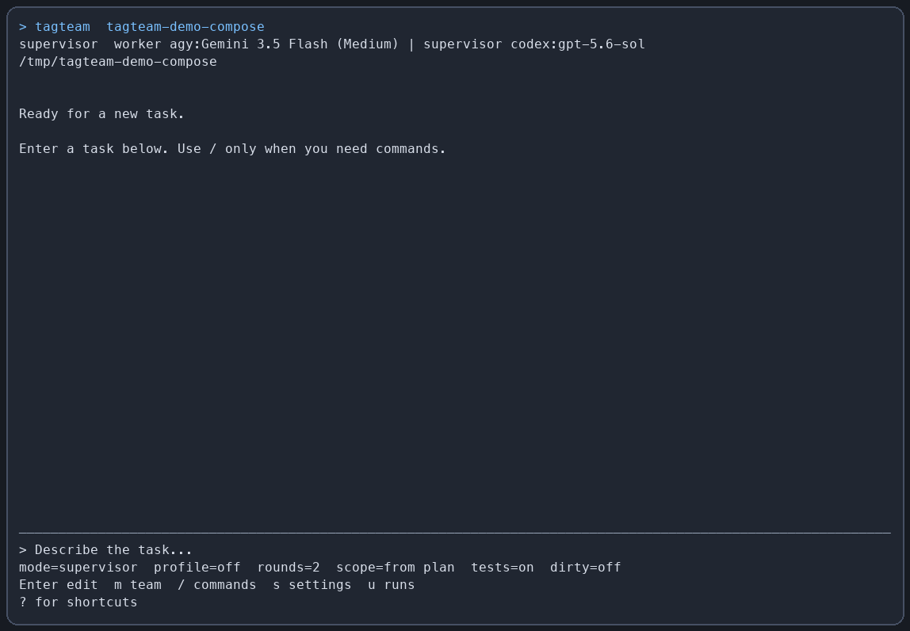
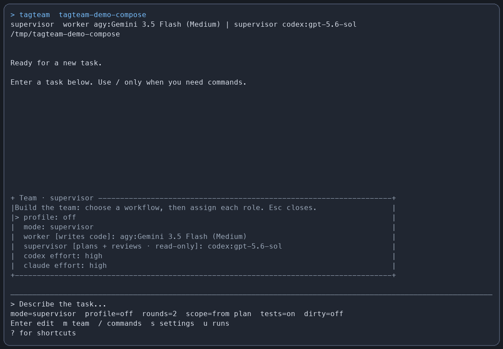
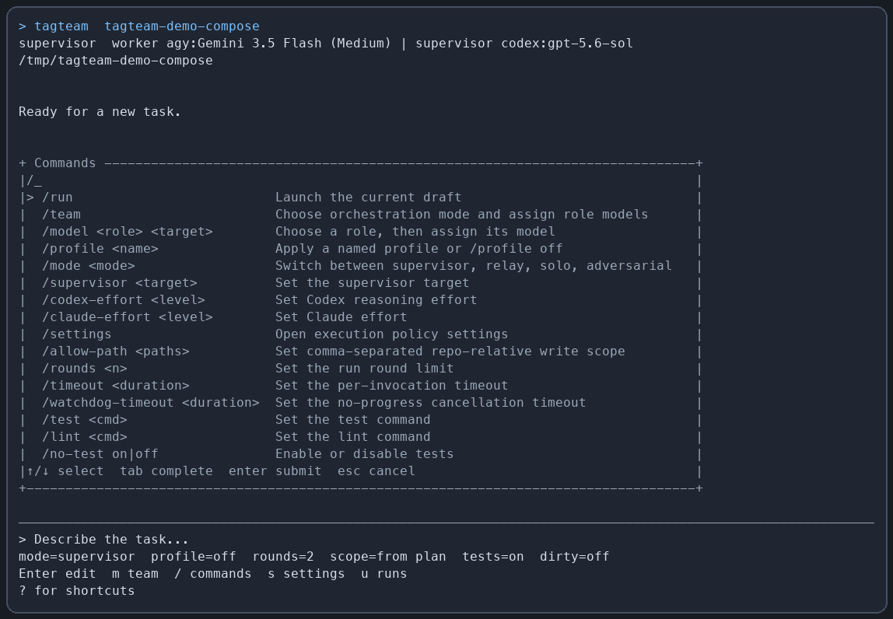
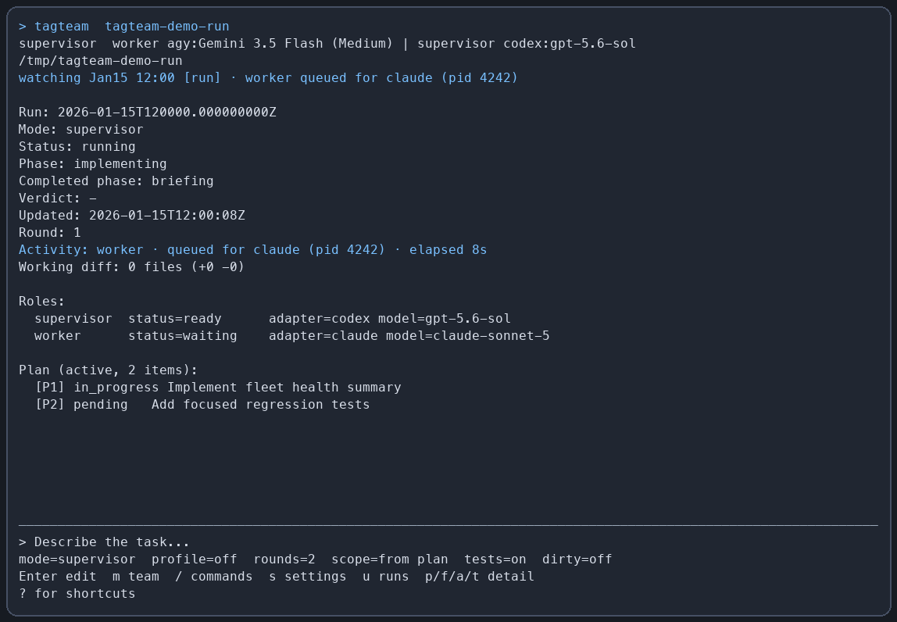

# tagteam

[](https://github.com/cephalopod-ai/tagteam/actions/workflows/ci.yml)
[](https://github.com/cephalopod-ai/tagteam/releases)
[](LICENSE)
[](go.mod)
[](#install)

**A standalone Go CLI that runs one or more headless coding agents as one command.**

You already have coding agent CLIs installed — `claude`, `codex`, `agy`, whatever. Running two of them together, one writing code and one reviewing it, means babysitting a handoff: copy the diff, paste it into the other tool, feed the findings back, repeat. `tagteam` makes that combo a single command. You say what you want, it drives the whole back-and-forth, and it saves every brief, diff, review, and test result so you can see exactly what happened instead of trusting a vendor UI.

The multi-agent part is implicit. You don't wire up a pipeline; you pick a mode and go.

| | |
|---|---|
| **Default flow** | `supervisor` writes a brief + reviews → `worker` implements, loops until it passes |
| **Language / runtime** | Go 1.23+, single static binary |
| **Platforms** | macOS (`amd64`/`arm64`), Linux (`amd64`/`arm64`) |
| **Requires** | Git + at least one supported agent CLI already logged in |
| **License** | MIT |

## Contents

- [Highlights](#highlights)
- [What's New In v1.1.0](#whats-new-in-v110)
- [Modes](#modes)
- [Architecture at a glance](#architecture-at-a-glance)
- [Status](#status)
- [Requirements](#requirements)
- [Authentication](#authentication)
- [Compatibility issues & rough edges](#compatibility-issues--rough-edges)
- [Install](#install)
- [Quick start](#quick-start)
- [Configuration](#configuration)
- [Run artifacts](#run-artifacts)
- [TUI](#tui)
- [Development](#development)
- [Scope](#scope)
- [License](#license)

## Highlights

- **One command, not a config project.** Pick a mode and go — no pipeline to wire up.
- **Cost-shaped by design.** Put a cheap model on the grunt work and a stronger one on review, or point everything at frontier models and let them fight it out — the roles make the tradeoff explicit.
- **Transparent by default.** Roles are explicit and every brief, diff, review, and test result is written to the external state store under `~/.local/state/tagteam/<repo-id>/runs/<run-id>/` — nothing is hidden behind a vendor UI.
- **Findings loop back automatically.** Reviewed modes feed review findings back to the editor role until the change passes, tests fail, or the round limit is reached.

> [!NOTE]
> **Why it exists:** a quick way to combine agent CLIs without configuring each one from scratch, that still fits enough situations to be worth reaching for by default.
>
> **Why it's simple:** if you're a serious coder who wants fine-grained control over every agent, `tagteam` is probably too simple for you — and that's fine.

## What's New In v1.1.0

`v1.1.0` builds on the stable command, configuration, artifact-schema, and exit-code contracts introduced in `v1.0.0`. This release tightens Git safety and vendor-adapter behavior while preserving all four orchestration modes. Adapter-specific rough edges remain documented in [Compatibility issues & rough edges](#compatibility-issues--rough-edges).

Highlights in `v1.1.0`:

- **New default team.** Supervisor and relay flows now default to Claude Opus 4.8 for read-only supervision, GPT-5.6 Terra for implementation, and local Ollama `gemma4:latest` for relay scouting. Agy and Codex Sol remain bounded fallback targets.
- **Evidence-based Claude roles.** Claude is supported as a read-only supervisor or adversary. Worker/coder assignments are rejected because substantive Sonnet and Opus implementation runs did not reliably complete Tagteam's edit/output lifecycle; Claude scout assignments remain disabled pending a dedicated trial.
- **Safer dirty-worktree execution.** `--allow-dirty` checkpoints existing work on a new `tagteam/<run-id>` branch, producing a clean baseline instead of treating an uncontrolled dirty tree as the run baseline.
- **Clearer Claude failures.** Structured Claude error envelopes are preserved even when the Claude process exits nonzero, so errors such as `error_max_structured_output_retries` remain visible and configured fallback ladders can respond to the real cause.
- **Interactive TUI continuity.** Supervisor, relay, solo, and adversarial workflows remain available without leaving the TUI; solo supports focused implementation or planning, while adversarial mode supports independent audits.
- **Better live-state observability.** In-progress runs publish external `active.json`, richer phase/progress state, and a shared run snapshot surface that powers both the TUI and status-style views.
- **Opt-in JSON repair for malformed contract output.** `--repair-json-with-worker` and `json_repair = "worker"` explicitly allow the selected worker to act as a read-only parser workaround for invalid JSON artifacts; repaired runs are marked degraded with `json_repair_used`.
- **More resilient Claude-heavy setups.** Contract-aware embedded-JSON recovery absorbs fenced/prose Claude responses, self-reported Claude envelope errors enter the existing fallback ladder, cross-process Claude invocations are serialized by default with a fail-closed lock (queued invocations surface as `waiting` in `tagteam status` and the TUI), and the built-in `claude-failover` profile adds target-specific Codex replacements.
- **Persistent findings and safer continuation.** `tagteam findings` exposes unresolved findings across historical runs, while `resume` and `transfer` preserve integrity, baseline, and acceptance gates instead of silently treating the latest run as authoritative.

## Modes

| Mode | Flag | Roles | Best for |
|---|---|---|---|
| **Supervisor** *(default)* | *(none needed)* | `supervisor` writes a brief + reviews (read-only by default) → `worker` implements | Zero-config default with a strong review loop |
| **Relay** | `--relay` / `--mode relay` | cheap read-only `scout` recon → write-enabled `coder` → stronger read-only `supervisor` reviews/arbitrates | Cost-aware pipeline with reconnaissance before editing |
| **Solo** | `--solo <adapter[:model]>` / `--mode solo` | one implementation or planning agent, nothing else | Focused work without leaving Tagteam or the TUI; output explicitly reports `review=none` |
| **Adversarial** | `--mode adversarial` | `coder` implements → independent `adversary` reviews | Audits and intentionally independent review loops |

> [!TIP]
> In every reviewed mode (supervisor, relay, adversarial), findings loop back into the editor role until the change passes review, tests fail, or the round limit is reached. When the limit hits with unresolved blocker/major findings, `tagteam` stops asking for edits and instead asks both agents for final "what remains incomplete / what do you dispute" reports. Solo mode runs once and never pretends to be reviewed.

## Architecture at a glance

Reviewed modes run an implement → diff → test → review loop, feeding findings back to the editor until the change passes, tests fail, or the round limit is reached:



Full documentation — architecture, more diagrams, and the test ledger — is indexed in [docs/INDEX.md](docs/INDEX.md).

## Status

This repository reflects the `v1.1.0` release surface: the core run loop, adapter abstraction, persisted run artifacts, live status plumbing, role policy, dirty-worktree checkpointing, and the full command set are implemented and covered by the test ledger. The remaining rough edges are adapter-behavior issues and general ergonomics rather than missing core workflow support.

Included in the `v1.1.0` surface:

- supervisor/worker mode is now the default flow
- relay scout/coder/supervisor mode is available with `--relay`
- solo mode keeps focused planning or implementation inside Tagteam and the TUI
- adversarial coder/adversary mode supports audits and independent review
- saved run artifacts include briefs, diffs, reviews, tests, and final summaries
- active runs publish external `active.json` so live views can discover in-flight work without exposing host state to workers
- command surface now includes `run`, `review`, `fix`, `resume`, `status`, `plan`, `transcript`, `findings`, `transfer`, `tui`, `mcp`, `doctor`, and `init`
- config layering supports repo config, user config, env overrides, flags, and named profiles
- explicit JSON repair is available through `--repair-json-with-worker` / `json_repair = "worker"`
- explicit repo instruction files are loaded by default and appended to role prompts
- machine-readable output and dry-run support make the CLI easier to script and debug

Current commands:

```
tagteam "<prompt>"
tagteam run "<prompt>"
tagteam review
tagteam fix
tagteam resume [RUN_ID]
tagteam status
tagteam plan [RUN_ID]
tagteam transcript [RUN_ID]
tagteam findings [--all]
tagteam findings defer RUN_ID FINDING_ID --reason "..."
tagteam transfer RUN_ID --test "..." --lint "..."
tagteam tui [RUN_ID]
tagteam mcp
tagteam doctor
tagteam init
```

`tagteam run` is an explicit alias for the default positional run path. Like
other agent CLIs, Tagteam also accepts `-m` / `--model`; because Tagteam is
multi-agent, that flag selects only the active implementation role (worker,
coder, or solo model). Use `--supervisor`, `--reviewer`, or `--scout` for the
other roles.

`tagteam mcp` is a local stdio MCP server. It exposes bounded tools for
capabilities, launch validation, start preparation, resume assessment,
approved/idempotent starts, resumes, and cancels, status, plans, findings, and
diagnostics.
`prepare_start` returns the exact action digest that `start` requires after
user confirmation; `prepare_resume` reports whether an existing run meets
resume preconditions without changing it. `start` is marked destructive for
MCP clients and requires an expiring, single-use approval record. `cancel` is
also destructive and approval-bound; a live run can be cancelled only by the
MCP runtime that owns its cancellation context. A live run owned by another
runtime returns a typed `run_not_owned` error.

Released binaries can expose the lifecycle mutation tools normally.
Development or otherwise unverified builds keep MCP read-only unless the
operator starts the server with `tagteam mcp --allow-dev-build`; this matches
Tagteam's existing mutation gate.

## Requirements

- Go 1.23+
- Git
- At least one supported agent CLI on `PATH`

> [!IMPORTANT]
> The selected `--workdir` (the current directory, if unset) must itself be a Git repo with at least one commit — `tagteam` runs `git rev-parse --verify HEAD` there during preflight and uses that commit as the diff baseline for every round. A folder that only *contains* repos (e.g. a workspace directory with several projects as subfolders) does not qualify; point `--workdir` at the actual repo, not a parent above it. Failing this check exits with `workdir is not a git repo or has no HEAD`.

Supported adapters in this repo today:

| Adapter | Role support |
|---|---|
| `codex` | full |
| `codex-oss` | full |
| `claude` / Claude Code | read-only supervisor or adversary; worker/coder and scout assignments are rejected |
| `agy` | full |
| `gosling` | coder-only |
| `grok` | all roles exposed; worker/coder use remains buggy, especially with `grok-4.5` at `medium` or `low` reasoning effort |
| `openai-compatible` / `oai` | read-only reviewer/scout (first cut) |

The Grok CLI integration is verified against Grok Build 0.2.93. It invokes
root-level headless `grok --single <prompt> --cwd <dir>` with optional `--model` and
`--reasoning-effort`, `--output-format json`, and explicit role permissions:
coders use `acceptEdits` with `read_file,list_dir,write_file,search_replace,run_terminal_cmd`;
all read-only roles use `dontAsk` with `read_file,list_dir`. System prompts use
the verified `--rules` flag. `--json-schema` is emitted only for coder,
adversary, and supervisor roles; Grok's JSON mode returns one JSON object at
the end of the headless run, and Tagteam parses the review/scout contracts
from that object. The prompt is a positional argument, so Grok receives no
stdin prompt.

> [!WARNING]
> This verifies the CLI integration, not reliable end-to-end implementation.
> Grok worker/coder runs remain experimental, and `grok-4.5` at `medium` or
> `low` reasoning effort is not reliable. Prefer Codex or Agy for routine
> implementation work.

## Authentication

Each vendor CLI adapter (`codex`, `claude`, `agy`, `gosling`, `grok`, etc.) must already be logged in on your machine before you run `tagteam`. `tagteam` does not run vendor login flows, store credentials, or proxy/inject API keys for those CLIs. If an adapter is not authenticated, the run will fail with that CLI's own auth error.

This note applies to the vendor CLI adapters; the separate `openai-compatible` adapter uses its documented `api_key_env` setting.

> [!NOTE]
> `tagteam` also reads a repo-local `.env` file from the selected workdir as a scoped overlay. It does not mutate the global process environment; exported shell variables still take precedence, and `.env` values are passed only to tagteam's config resolver and invoked adapters/tests. A starter template is included as [`.env_template`](.env_template).

## Compatibility issues & rough edges

> [!WARNING]
> `tagteam` depends on third-party agent CLIs and compatible HTTP backends whose behavior can change without warning. Expect some adapter-specific rough edges, especially as upstream tools evolve.

<details>
<summary><strong>Current caveats</strong></summary>

- Vendor CLI flag drift can break adapters. `codex`, `codex-oss`, `claude`, `agy`, `gosling`, and similar tools may rename flags, change output formats, or alter auth behavior between releases.
- Authentication is adapter-specific. CLI-backed adapters usually rely on the vendor's own login/session flow; `openai-compatible` / `oai` relies on explicit environment/config values.
- Supervisor slicing is more format-sensitive than the final review pass. The final review path is schema-validated, but some supervisor planning/instruction steps still depend on adapter output being reasonably well-formed.
- Claude Code can occasionally ignore `--output-format json` / `--json-schema` during supervisor review and return prose such as `Review...` instead of the expected JSON envelope. `tagteam` retries once and searches a bounded set of contract candidates embedded in the prose: fenced ```json blocks are tried first, followed by balanced JSON objects, so an unrelated or unmatched brace snippet earlier in the prose no longer masks the real payload. Claude envelopes that self-report failure (`is_error` / `error_*` subtypes such as `error_max_turns`) are surfaced as clear adapter errors (`claude reported error_max_turns: ...`) instead of misleading `decode ... JSON` contract failures, which lets the fallback ladder engage. If no valid JSON is present, the run exits as an adapter/output-contract failure and preserves the invalid output artifacts for inspection. If you intentionally want the already-selected worker to act as a read-only parser workaround, pass `--repair-json-with-worker` or set `json_repair = "worker"`; repaired runs are marked degraded with `json_repair_used`.
- Claude is supported as a read-only `supervisor` or `adversary`. Tagteam rejects Claude targets selected as worker/coder because repeated substantive Sonnet and Opus runs did not complete the editing/output-contract lifecycle reliably; Claude scout assignments remain unsupported pending a real scout trial. Sonnet 5 and Opus 4.8 completed schema-validated supervisor reviews, and a real Haiku adversary run completed a schema-valid review. Use Codex or Agy for implementation roles.
- Concurrent Claude Code processes can stall or remain pending, especially in relay/multi-role configurations. `tagteam` now serializes Claude invocations across its own processes by default with an OS-specific cross-process lock under the resolved state root (`adapters.claude.serialize`, `TAGTEAM_CLAUDE_SERIALIZE`); Unix/macOS use `flock`, while Windows uses a PID-file fallback. Waiting runs log `waiting for concurrent claude invocation`, and a crashed Unix/macOS holder releases the lock automatically. Serialization is fail-closed: a run that cannot acquire the lock within its invocation timeout fails that invocation with a classified adapter error (so configured fallbacks such as `claude-failover` can engage) instead of running unlocked.
- Claude serialization is scoped to a state root, not the whole machine. Tagteam processes configured with different `--state-root` values use different locks and can still overlap; use one shared state root for concurrent Claude-backed runs. The lock also cannot see Claude processes started outside Tagteam. `tagteam doctor` confirms binary availability but cannot detect either form of contention.
- Unix/macOS Claude locking is runtime-tested with real multi-process contention. The Windows PID-file fallback is compile-checked but not runtime-tested in CI; ownership-record write failures and same-process concurrent invocations remain residual risks there. Prefer one Claude-backed Tagteam run at a time on Windows until that path has equivalent runtime coverage.
- Do not launch two Tagteam runs against the same worktree. Run-state locking and integrity checks assume one active writer per worktree; use separate Git worktrees when runs need to proceed concurrently, even when their Claude invocations would otherwise serialize.
- `--allow-dirty` is isolation, not an integrity bypass: Tagteam creates a `tagteam/<run-id>` branch, commits the pre-existing tracked and untracked changes as a local checkpoint, and uses that clean commit as the run baseline. The source branch remains unchanged. The checkpoint requires a usable local Git author configuration and is intentionally preserved for recovery and review.
- A stalled or externally interrupted adapter process may leave `state.json` at `status=running` / an early phase without writing `final.json`. Treat that run as interrupted and use `tagteam resume [RUN_ID]`; resume verifies the baseline, diff hash, and required artifacts, then continues the first incomplete phase or quarantines unsafe partial work. Do not treat `active.json` or the TUI alone as evidence of success.
- Different adapters do not expose identical capabilities. Some support schema-constrained output, stdin, or session resume; others do not. `tagteam` degrades where possible, but behavior is not perfectly uniform.
- Grok remains buggy in the worker/coder role. In particular, `grok-4.5` with `medium` or `low` reasoning effort has not been reliable; prefer another implementation adapter, or treat Grok worker runs as experimental and validate them closely.
- Local `.env` loading is a convenience feature, not a secret-management system. It helps with local runs, but shell-exported environment variables still take precedence.
- Repo-local `.tagteam.toml` is partially trusted by default: low-authority defaults such as roles/models can be read, but shell tests, adapter passthrough args, Claude permission/tool widening, and `openai-compatible` endpoints/headers are ignored unless you pass `--trust-repo-config`.
- Published binaries are broader than real-world manual validation. Releases may include targets that pass Go-level CI but have not been exercised end-to-end with every supported vendor CLI.

</details>

Practical guidance:

- Prefer `tagteam doctor` before blaming orchestration logic.
- Use `--dry-run` to inspect resolved invocations when an adapter behaves unexpectedly.
- Start with small prompts and targeted tests when trying a new adapter/model pairing.
- Do not use Grok as an unattended worker/coder; `grok-4.5` at `medium` or `low` reasoning effort is especially unreliable.
- Treat new modes, new adapters, and unusual cross-vendor combinations as experimental until you have run them in your own environment.

### Error behavior

Tagteam validates host-controlled requirements before launching an agent and
returns the first invalid input in deterministic argument order. These errors
name the rejected value, the violated rule, and a valid correction when one is
available. For example:

```text
invalid --allow-path "/internal": path must be repo-relative, not absolute; use "internal" for an exact path or "internal/" for a directory
```

Write scopes accept exact repo-relative files (`README.md`), directory prefixes
ending in `/` (`docs/` or `./docs/`), and `.` for the whole repository. Absolute
paths, parent traversal, globs, blanks, backslashes, and normalized duplicates
are rejected before an adapter starts.

CLI exit codes and persisted `reason_code` / `blocking_reason` values are the
stable machine-readable contract. OS, Git, network, and vendor CLI details may
vary and are preserved as diagnostic context rather than normalized into
misleading text. Semantic objections from agents must be represented in their
structured surface: reviewer findings, work-plan deferrals, worker
`remaining_risks`, or round-exhaustion reports. A model's unstructured objection
does not override host validation or count as a successful run.

## Install

With a Go toolchain (1.23+):

```bash
go install github.com/cephalopod-ai/tagteam@latest
```

Or download a prebuilt archive for your platform from GitHub Releases, then put the `tagteam` binary on your `PATH`.

Release archives include `tagteam.sha256` beside the binary. Verify embedded version, full commit SHA, UTC build time, dirty-tree status, and the installed checksum with:

```bash
tagteam version --json
tagteam verify-install
```

Commands that can edit a checkout reject missing/tampered manifests, dirty release metadata, and ambiguous `dev` builds. `--allow-dev-build` is an explicit escape hatch for local development; read-only status, plan, transcript, doctor, version, verification, and TUI inspection remain available for diagnosis.

Binary releases are published for:

- macOS (`darwin/amd64`, `darwin/arm64`)
- Linux (`linux/amd64`, `linux/arm64`)

> [!NOTE]
> Windows is not validated. The test suite relies on POSIX shell adapters, so `tagteam` is only exercised and released on macOS and Linux. It may well build and run on Windows — if you get it working and verify it, open an issue or PR and I'm more than happy to add Windows back to CI and releases.

Create the release by pushing the `v1.1.0` tag; GitHub Actions runs Go checks on macOS and Linux, then GoReleaser attaches archives plus `checksums.txt` to the release.

Build from source (development builds must be explicitly allowed for commands that edit a worktree):

```bash
go build -o tagteam .
```

Run locally:

```bash
go run . --allow-dev-build "add OAuth login"
```

## Quick start

Default run (supervisor mode, Gemini 3.5 Flash Medium worker and GPT-5.6 Sol supervisor at high reasoning effort):

```bash
tagteam "add OAuth login"
# Equivalent explicit one-shot spelling:
tagteam run -m 'agy:Gemini 3.5 Flash (Medium)' "add OAuth login"
```

That's the whole thing — no flags, no config. From your repo root you just describe the change:

```bash
cd my-project
tagteam "add a --json flag to the export command and cover it with a test"
```

With no other options, `tagteam` uses the default supervisor mode: Claude Opus 4.8 writes a brief and reviews, while `codex:gpt-5.6-terra` implements. Findings loop back until the change passes review, tests fail, or the round limit is hit. If the Terra worker fails before changing the worktree, Tagteam retries with `agy:Gemini 3.5 Flash (Medium)`; the `claude-failover` profile maps Opus review failures to `codex:gpt-5.6-sol`. Partial edits still require recovery arbitration or quarantine. Every brief, diff, review, and test run is written to the external state store, and the final verdict prints to the terminal. Run `tagteam status` during a run to see its phase, role, elapsed/idle time, diff summary, provider-lock queue context, and host-owned baseline-test activity. If a baseline command mutates the worktree, status attributes the failure to `tagteam-host` and lists the exact changed paths. Use `tagteam doctor` first if you're not sure your agent CLIs are set up.

Supervisor mode slices work by default before the worker edits. The supervisor writes a bounded work plan, selects one package, and the worker implements only that package. If packages remain, `tagteam` stops after the selected package passes and reports the next packages unless `--auto-next-package` is set.

```bash
tagteam --slice --max-packages 5 --package P1 "add OAuth login"
```

For a Claude-free supervisor run, choose explicit worker/supervisor adapters, rounds, and a test command:

```bash
tagteam \
  --worker 'agy:Gemini 3.5 Flash (Medium)' \
  --supervisor codex:gpt-5.6-sol \
  -r 3 \
  -t "go test ./..." \
  "refactor billing flow"
```

> [!TIP]
> The supervisor is read-only by default (it writes the brief and review findings but does not edit files). Allow it to make small exploratory edits with `--supervisor-can-edit`.

Supervisor slicing also creates a run checklist. `plan.json` records package status, and `plan-events.jsonl` records status transitions and review-added items. `tagteam status` shows the latest checklist when present; use `tagteam plan [RUN_ID]` to print a run's checklist directly.

Supervisor and relay runs may perform one bounded orchestration adjustment before implementation starts. Agents can emit compact advisory signals, but `tagteam` owns the decision: relay may simplify to supervisor mode for small tasks, and supervisor mode may escalate to relay only when the worker reports insufficient context and the supervisor agrees. There is no back-and-forth replanning loop.

### Solo mode

Solo mode runs exactly one implementation agent and no reviewer. It is useful as a quick baseline for comparing cost, speed, and quality against supervisor, relay, or adversarial runs.

```bash
tagteam --solo codex:gpt-5.6-terra "rename UserSvc to UserService"
tagteam --mode solo --worker codex:gpt-5.6-terra -t "go test ./..." "make a small README edit"
```

> [!IMPORTANT]
> In solo mode, legacy `-mc` and preferred `--worker` both select the implementation agent. Reviewer flags such as `-ma`, `--reviewer`, and `--supervisor` are invalid.

### Relay mode

Relay mode runs a cost-aware three-agent pipeline: read-only scout reconnaissance, supervisor brief, supervisor-condensed worker instructions, coder implementation, deterministic diff capture, tests, post-implementation scout advisory pass, and strict supervisor review.

```bash
tagteam --relay "add OAuth login"
```

For small tasks, relay can simplify to supervisor mode before scout runs when the supervisor advises that the direct worker/review path is enough. The host records the decision and skips scout-heavy relay setup; the supervisor review remains the authoritative gate.

Relay mode is a full-run workflow. It does not currently have a review-only variant: `tagteam review` remains adversary-only and does not run scout or supervisor relay steps.

The built-in relay profile uses a local Ollama Gemma scout through its OpenAI-compatible `/v1` endpoint. Ensure Ollama is running on `127.0.0.1:11434`; otherwise the default non-strict scout policy records the failure and continues without scout context.

```toml
[profiles.relay]
mode = "relay"
scout = "openai-compatible:gemma4:latest"
coder = "agy:Gemini 3.5 Flash (Medium)"
supervisor = "codex:gpt-5.6-sol"
scout_mode = "recon"
scout_retrieval = false
scout_failure_policy = "continue"
post_scout_mode = "polish"
rounds = 2
```

Override relay roles explicitly:

```bash
tagteam \
  --mode relay \
  --scout openai-compatible:gemma4:latest \
  --scout-mode recon \
  --post-scout-mode polish \
  --coder 'agy:Gemini 3.5 Flash (Medium)' \
  --supervisor codex:gpt-5.6-sol \
  "refactor billing flow"
```

In relay mode, legacy `-mc` selects the coder and `-ma` selects the supervisor. Scout modes are task-typed: `recon`, `lint`, `polish`, `tests`, or `risk`. Scout findings are advisory context only; only the supervisor review can fail a run with blocker/major findings.

If Claude Code is already busy, use a non-Claude relay assignment rather than waiting on a contested role. With Ollama serving its OpenAI-compatible endpoint locally, use Gemma as the read-only scout, Gemini as the coder, and GPT-5.6 Terra as the supervisor:

```bash
TAGTEAM_OPENAI_COMPATIBLE_BASE_URL=http://127.0.0.1:11434/v1 \
tagteam --relay --no-scout-retrieval \
  --scout openai-compatible:gemma4:latest \
  --coder 'agy:Gemini 3.5 Flash (Medium)' \
  --supervisor codex:gpt-5.6-sol \
  -t 'git diff --check' \
  "make a scoped documentation change"
```

`openai-compatible` is read-only in this release, so Gemma is valid as a scout but not as a coder. This is an operational workaround, not a runtime-verified guarantee for those exact models. Keep role failures visible in the saved run artifacts and configure fallbacks for any unattended workflow.

> [!TIP]
> The built-in local Gemma scout runs without retrieval. If you enable retrieval or replace it for a large repository, use a scout with a strong context window — a practical recommendation is `256k` or more, and ideally at least as much context as the relay coder and supervisor. Small-context scouts tend to lose most of the benefit of relay reconnaissance once repo instructions, retrieval evidence, and task context are included.

<details>
<summary><strong>Advanced relay configuration: retrieval, context budgets, failure policy, fallbacks</strong></summary>

Relay pre-scout `recon` has bounded local retrieval disabled by default because the built-in Gemma scout is local and typically has a smaller context window. Retrieval is host-owned, local-only, advisory, and does not use embeddings, network search, persistent indexes, daemons, or background caches. Enable it only in a profile/configuration with a sufficiently large scout context; disable it explicitly with `--no-scout-retrieval`:

```bash
tagteam --relay --no-scout-retrieval "add OAuth login"
```

Retrieval runs only for relay pre-scout `scout_mode = "recon"` and never for post-scout, supervisor mode, adversarial mode, or solo mode. If `rg` is missing, retrieval times out, or no useful matches are found, tagteam records that status and continues with normal scout reconnaissance. Configure it with `scout_retrieval = true|false` or `TAGTEAM_SCOUT_RETRIEVAL=false`; flags still have highest precedence.

If an adapter has explicit context limits configured, relay pre-scout `recon` also writes `scout-context-round-1.json` before calling the scout. The check is deterministic and conservative (`ceil(prompt_bytes/3)`), not provider metadata. Statuses are `unknown`, `ok`, `near_limit`, or `exceeds_limit`. Near-limit runs compact retrieval more aggressively; retrieval is disabled if it alone would push the scout prompt over the configured usable context. Use `scout_context_policy = "warn" | "skip" | "block"` or `--scout-context-policy` to decide whether a too-small configured scout context only warns, skips/degrades the scout pass, or blocks before scout invocation.

### Code-intelligence sensor

Relay pre-scout can run configured, read-only `command`, `codebase-memory`, and `gitnexus` subprocess providers before scout invocation. Each receives bounded JSON stdin and must return a bounded `CodeIntelArtifact`; failures are retained as partial diagnostics. Provider observations are revision-bound to a snapshot identity that includes a dirty-worktree digest. Only fresh observations are compacted into scout context. Missing commands, malformed output, timeouts, stale indexes, and allowlist denials remain visible in the artifact or gateway JSON.

`tagteam intel orient|find|trace|impact|resume|recall|evidence` is the stable JSON/MCP-wrapper command contract. `evidence` writes then validates a Muninn candidate-evidence envelope; `recall` validates a configured Muninn envelope; `resume` validates a configured Dory envelope. `tagteam intel bench` writes deterministic `intel-bench.json` under Tagteam's external runs root by default (use `--run-dir` to override); it intentionally contains no generated timestamp or latency fields. `tagteam intel status` reads sensor artifacts without parsing `final.json`. File contracts for Dory checkpoints, Alexandria observation/consumption events, and Muninn candidate evidence are versioned and require `enabled = true`; they are not network clients, graph dumps, or memory promotion. Dory, Alexandria, and Muninn are not included in this checkout: their operators must consume these versioned JSON file envelopes and own any transport or promotion.

Use `tagteam integrate plan|install|doctor|uninstall --target <codex|claude|cursor|vscode|mcp-json> --path <file>` to manage only Tagteam-owned configuration. `codex` manages a versioned `#` block in the explicit `config.toml` path and `claude` a versioned `#` block in its explicit text/Markdown path. `cursor` (`.cursor/mcp.json`), `vscode` (`.vscode/mcp.json`), and `mcp-json` manage only the versioned `mcpServers.tagteam` entry, invoking `tagteam mcp`. `plan` never writes; invalid marker/JSON input is refused; JSON preserves unknown keys but install/uninstall may reformat it.

Scout model failures are explicit and configurable. By default, `scout_failure_policy = "continue"` warns, writes `scout-execution-round-1.json`, and continues without scout context so the coder and supervisor can still run. Use `--strict-scout` or `scout_failure_policy = "fail"` when evaluation or reproducibility should abort before coder edits if the scout invocation, scout JSON contract, or scout context-budget check fails. Retrieval unavailable/timeout/empty/degraded states are separate from scout model failure and continue into the scout pass where possible.

For finer control, `loss_policy` can be configured per non-primary role: `block`, `degrade`, `replace_then_block`, or `replace_then_degrade`. Replacement is bounded: tagteam may replace an unavailable target during preflight, and reviewer/supervisor review calls may try the configured fallback chain once after an invocation or output-contract failure. Fallback chains are ordered, deduped, capped at five targets, and recorded in `final.json`.

The built-in `claude-failover` profile enables a small Claude-to-Codex fallback ladder for review/supervision failures:

```bash
tagteam -P claude-failover --mode supervisor --worker codex:gpt-5.6-terra --supervisor claude:claude-opus-4-8 "fix the bug"
```

It maps the current Opus target to `codex:gpt-5.6-sol` and the current Sonnet target to `codex:gpt-5.6-terra`; compatibility aliases for older Claude CLI model names remain available. Target-specific fallbacks run before role-level fallback lists.

</details>

### Adversarial mode

Adversarial mode keeps implementation and independent audit/review explicitly separated. It is useful when the reviewer should challenge the coder without also owning the plan. The `-mc`/`-ma` slot flags map onto the active mode's roles: `-mc` selects the worker in supervisor mode and the coder in adversarial mode; `-ma` selects the supervisor in supervisor mode and the adversary in adversarial mode.

```bash
tagteam --mode adversarial \
  -mc codex:gpt-5.6-terra \
  -ma claude:claude-opus-4-8 \
  -r 3 \
  -t "go test ./..." \
  "refactor billing flow"
```

`--reviewer` is an adversarial-mode-flavored alias for `-ma`/`--supervisor`:

```bash
tagteam --mode adversarial -mc codex:gpt-5.6-terra --reviewer claude:claude-opus-4-8 "audit the CLI cleanup"
```

Use Agy with its configured default Gemini model:

```bash
tagteam --worker agy --supervisor codex:gpt-5.6-sol "clean up the CLI help"
```

The built-in `agy` default model is `Gemini 3.5 Flash (Medium)`; override it with `agy:<model>`.

### OpenAI-compatible reviewers

<details>
<summary><strong>Featherless.ai, OpenRouter, and other <code>/chat/completions</code> gateways</strong></summary>

`openai-compatible` adds a small HTTP adapter for OpenAI-compatible `/chat/completions` APIs such as Featherless.ai, OpenRouter, and local gateways. This first cut is read-only: use it as the adversary/reviewer or relay scout, not as the coder/worker.

Featherless.ai:

```toml
[adapters.openai_compatible]
base_url = "https://api.featherless.ai/v1"
api_key_env = "FEATHERLESS_API_KEY"
default_model = "openai/gpt-oss-120b"
```

Create a local `.env` first:

```bash
cp .env_template .env
```

Then set:

```bash
FEATHERLESS_API_KEY=your-key-here
```

```bash
tagteam \
  --mode adversarial \
  -mc codex:gpt-5.6-terra \
  -ma openai-compatible:openai/gpt-oss-120b \
  --show-review \
  "make a tiny README wording cleanup"
```

OpenRouter:

```toml
[adapters.openai_compatible]
base_url = "https://openrouter.ai/api/v1"
api_key_env = "OPENROUTER_API_KEY"
default_model = "openai/gpt-oss-120b"
extra_headers = { "HTTP-Referer" = "https://github.com/your/repo", "X-Title" = "tagteam" }
```

Equivalent environment overrides are available for `base_url`, `api_key_env`, model, and simple comma-separated headers via `TAGTEAM_OPENAI_COMPATIBLE_BASE_URL`, `TAGTEAM_OPENAI_COMPATIBLE_API_KEY_ENV`, `TAGTEAM_OPENAI_COMPATIBLE_MODEL`, and `TAGTEAM_OPENAI_COMPATIBLE_HEADERS`.

</details>

Review the current diff only:

```bash
tagteam review --fail-on-review
```

Apply fixes from the latest saved review:

```bash
tagteam fix
```

## Configuration

> [!NOTE]
> **Precedence:** `flags > shell TAGTEAM_* env > workdir .env TAGTEAM_* overlay > repo .tagteam.toml > user config > built-in defaults`

If a `.env` file exists in the selected workdir, `tagteam` parses it as a small, line-oriented dotenv subset: `KEY=VALUE`, optional `export`, inline comments outside quotes, single-quoted raw values, and double-quoted escape sequences such as `\n`. `.env` is a convenience source for local development; it is not a full shell parser, and explicit shell exports still win.

Repo-local `.tagteam.toml` is loaded in untrusted mode by default. It can set ordinary role/model defaults, but high-authority settings such as `defaults.test`, `git_safety`, `code_intel_command`, `[test_presets]`, adapter `extra_args`, Claude `coder_allowed_tools` / `bare` / `serialize`, and `openai-compatible` `base_url`, `api_key_env`, `extra_headers`, or `extra_args` require `--trust-repo-config`. Untrusted repo config never contributes `[test_presets]` entries (they are stripped entirely).

### Trusted test presets (MCP / control plane)

MCP starts may select a test command only by **name** via `test_preset`. Named presets resolve from host-trusted configuration — primarily user config under `[test_presets.<name>]` — never from raw model/MCP command strings. Untrusted repo `.tagteam.toml` cannot inject presets; with `--trust-repo-config`, a trusted repo file may define them the same way as other high-authority keys. Names are exact-match identifiers (no case folding). Empty `test_preset` keeps Tagteam's normal trusted `defaults.test` / profile defaults. Unknown names fail closed with a stable error.

```toml
[test_presets.go-test]
command = "go test ./..."
identity_regex = "FAIL:\\s+(\\S+)"   # optional; must compile with a capture group

[test_presets.unit]
command = "make unit"
```

### Advisory Run Steward (MCP / control plane)

An optional, local-first **Run Steward** can summarize a run's progress and recommend a next action for the operator. It is **strictly advisory**: it reads only a bounded, sanitized `RunObservation` (status, phase, reason codes, and counts — never prompts, diffs, file paths, or model reasoning) and returns a schema-validated advisory whose `action` is one of `wait`, `inspect`, `notify`, `prepare_resume`, `ask_user`, or `report_issue`. It cannot edit the repository, change scope or roles, dismiss findings, run commands, or approve recovery, and the controller never gates execution on it.

Hosts read it through the read-only `tagteam_advise` MCP tool. The steward is **disabled by default**; when disabled, missing, slow, invalid, or over budget, a deterministic template steward is the guaranteed fallback, so a run never depends on a model. Enabling it points the default tier at a local OpenAI-compatible endpoint (e.g. Ollama) with conservative per-run call, timeout, and deduplication budgets, and a per-run lease keeps a single observer. The model request is text-only with no tool/function surface, so the steward cannot invoke Tagteam or inherit MCP/repository-write tools.

```toml
[steward]
enabled = true
base_url = "http://127.0.0.1:11434/v1"   # local OpenAI-compatible (Ollama)
api_key_env = ""                          # optional; env var name holding the key
model = "gemma4:latest"                   # required to enable the model tier
timeout_seconds = 10                      # per-advisory cap; run never blocks past it
max_calls_per_run = 20                    # per-run call budget
min_interval_seconds = 5                  # dedup identical observations within this window
```

User config path:

- macOS/Linux: `~/.config/tagteam/config.toml`

Starter config:

```bash
tagteam init
```

<details>
<summary><strong>All <code>defaults</code> keys</strong></summary>

| Key | Meaning |
|---|---|
| `mode` | `supervisor` (default), `solo`, `adversarial`, or `relay` |
| `worker` | `adapter[:model]` target used in solo mode, and in supervisor mode alongside `supervisor` |
| `supervisor` | `adapter[:model]` target used in supervisor mode, and in relay mode alongside `scout`/`coder` |
| `coder` / `adversary` | `adapter[:model]` targets used in adversarial mode |
| `relay_coder` | relay-specific implementation target; falls back to `coder` for older configurations |
| `scout` | `adapter[:model]` target used in relay mode |
| `scout_mode` / `post_scout_mode` | relay scout task modes: `recon`, `lint`, `polish`, `tests`, or `risk` |
| `scout_retrieval` | enable bounded local retrieval for relay pre-scout `recon` (default `true`; disable with `--no-scout-retrieval` or `TAGTEAM_SCOUT_RETRIEVAL=false`). Relay scouts work best with `256k+` context and ideally at least as much context as the relay coder/supervisor |
| `code_intel_command` | optional read-only command provider for relay pre-scout code intelligence; it receives JSON on stdin and must emit a bounded `CodeIntelArtifact` JSON document on stdout. Empty (default) disables the sensor; `TAGTEAM_CODE_INTEL_COMMAND` is the environment equivalent. |
| `[code_intel]` | optional `allowed_repos`, `exclude_paths`, and `timeout`; `[code_intel.providers.codebase-memory]` / `gitnexus` accept a `command`. `TAGTEAM_CODE_INTEL_COMMAND_CODEBASE_MEMORY`, `TAGTEAM_CODE_INTEL_COMMAND_GITNEXUS`, and `TAGTEAM_CODE_INTEL_TIMEOUT` are environment equivalents. |
| `[code_intel.dory|alexandria|muninn]` | explicit file-contract bridge settings: `enabled`, `path`, and optional `api_key_env` name. Tagteam never reads that secret or opens an endpoint. |
| `scout_failure_policy` | relay scout model failure handling: `continue` (default) or `fail`; `--strict-scout` maps to `fail`, and `TAGTEAM_SCOUT_FAILURE_POLICY` can override config |
| `scout_context_policy` | relay scout configured-context behavior: `warn` (default), `skip`, or `block`; `--scout-context-policy` overrides it |
| `supervisor_slicing` | split supervisor-mode work into bounded packages before implementation |
| `max_packages` | maximum package count for supervisor slicing |
| `package` | selected package ID to execute from the work plan |
| `auto_next_package` | continue into additional packages while the normal round cap allows it |
| `respect_repo_instructions` | load explicit repo instruction files and append them to role prompts |
| `rounds` | hard cap on implementation/review cycles; exhausted runs stop and collect final reports from both agents |
| `max_role_invocations` | optional hard cap on adapter calls in one run; `--max-role-invocations` overrides it |
| `json_repair` | explicit JSON contract repair mode: `off` (default) or `worker`; `--repair-json-with-worker` enables the selected worker as a read-only parser for invalid JSON artifacts |
| `state_root`, `watchdog_timeout` | authoritative external artifact root and no-progress timeout |
| `lint`, `test`, `test_identity_regex`, `git_safety` | transfer lint, focused tests, optional failure-identity regex, and git safety settings |
| `churn` | configurable `max_files`, `max_changed_lines`, `max_fixture_files`, `whitespace_ratio`, and `minimum_semantic_ratio` gates |

</details>

Profiles may override `mode`, `state_root`, `watchdog_timeout`, `scout`, `scout_mode`, `scout_retrieval`, `code_intel_command`, `scout_failure_policy`, `scout_context_policy`, `loss_policy`, `fallbacks`, `fallbacks_by_target`, `json_repair`, `post_scout_mode`, `worker`, `supervisor`, `coder`, `adversary`, `rounds`, `test`, `lint`, `test_identity_regex`, and `churn`. A profile that sets `coder`/`adversary` but omits `mode` resolves as an adversarial-mode profile, so profiles written before `mode` existed keep working unchanged:

```toml
[defaults]
mode = "supervisor"
worker = "codex:gpt-5.6-terra"
supervisor = "claude:claude-opus-4-8"
coder = "codex:gpt-5.6-terra"
relay_coder = "codex:gpt-5.6-terra"
adversary = "claude:claude-opus-4-8"
scout = "openai-compatible:gemma4:latest"
scout_retrieval = false
supervisor_slicing = true
max_packages = 5
rounds = 2
json_repair = "off"

[profiles.relay.loss_policy]
scout = "replace_then_degrade"
supervisor = "block"

[profiles.relay.fallbacks]
scout = ["openai-compatible:gpt-oss-120b"]
supervisor = ["claude:claude-opus-4-8"]

[profiles.claude-failover.loss_policy]
reviewer = "replace_then_block"
supervisor = "replace_then_block"

[profiles.claude-failover.fallbacks_by_target]
"claude:claude-opus-4-8" = ["codex:gpt-5.6-sol"]
"claude:claude-sonnet-5" = ["codex:gpt-5.6-terra"]
"claude:haiku" = ["codex:gpt-5.6-terra"]

[profiles.fast]
coder = "codex:gpt-5.6-terra"
adversary = "codex:gpt-5.6-sol"
rounds = 1
```

Adapter configs may optionally declare deterministic context budgets used by relay pre-scout `recon`:

```toml
[adapters.openai_compatible]
base_url = "https://api.example.test/v1"
api_key_env = "EXAMPLE_API_KEY"
max_context_tokens = 32768
reserved_output_tokens = 2048
```

Codex, Claude, and Grok inference effort is configured separately from model identity, following the same provider/model/settings separation used by mature agent CLIs:

```toml
[adapters.codex]
reasoning_effort = "high"

[adapters.claude]
effort = "high"

[adapters.grok]
default_model = "grok-4.5"
reasoning_effort = "high"
```

The equivalent environment variables are `TAGTEAM_CODEX_REASONING_EFFORT`, `TAGTEAM_CLAUDE_EFFORT`, `TAGTEAM_GROK_MODEL`, and `TAGTEAM_GROK_REASONING_EFFORT`. Grok passthrough arguments can be supplied with `adapters.grok.extra_args`, `TAGTEAM_GROK_ARGS`, or `--grok-args`.

Grok reasoning effort accepts `low`, `medium`, `high`, or `xhigh`; the
default `grok-4.5` model supports `low`, `medium`, and `high`, while `xhigh`
is available only on Grok models that advertise it. Although `low` and
`medium` are valid settings, `grok-4.5` at either setting is unreliable for
worker/coder assignments, and Grok implementation in general remains
experimental. Grok targets can be set as `grok:<model>` through `--worker`,
`--coder`, `--supervisor`, `--reviewer`, or `--scout`; the same targets are
available in the TUI `/model` picker and named profiles.

Claude invocations are serialized across tagteam processes by default because concurrent Claude Code processes can stall or remain pending. Disable this (for example when every run uses isolated Claude configuration) with:

```toml
[adapters.claude]
serialize = false
```

or `TAGTEAM_CLAUDE_SERIALIZE=false`. The lock lives at `<state-root>/locks/claude-invocation.lock` (following `--state-root` / profile overrides) and persists between runs; on Unix the kernel flock is the lock, so it cannot go stale. While an invocation is queued behind the lock, `live-progress.json` reports `status=waiting`, so `tagteam status` and the TUI show the run as queued rather than hung. A run that waits longer than its invocation timeout fails that invocation with a classified adapter error — role fallback policies apply — rather than running unlocked.

For `openai-compatible`, environment overrides are `TAGTEAM_OPENAI_COMPATIBLE_MAX_CONTEXT_TOKENS` and `TAGTEAM_OPENAI_COMPATIBLE_RESERVED_OUTPUT_TOKENS`. Omitted limits mean `unknown` and preserve existing relay behavior.

Repo instructions are loaded from the selected workdir, then from the Git root when different, in this exact file order: `AGENTS.md`, `agent.md`, `.tagteam/AGENTS.md`, `.codex/AGENTS.md`, `.claude/AGENTS.md`, `.agy/AGENTS.md`. Only those exact files are read; vendor skill/plugin directories are not recursively ingested. Disable this layer with `--no-repo-instructions`.

## Run artifacts

Each run writes artifacts under:

```text
~/.local/state/tagteam/<repo-id>/runs/<run-id>/
```

Override the root with `--state-root`, `TAGTEAM_STATE_ROOT`, or `state_root` in user config. The repository ID is the first 24 hexadecimal characters of SHA-256 over the canonical Git common-directory path, so linked worktrees share state. `.tagteam/repo.json` is the only runtime pointer retained in a worktree:

```json
{
  "schema_version": 1,
  "repo_id": "0123456789abcdef01234567",
  "state_root": "/home/user/.local/state/tagteam",
  "updated_at": "..."
}
```

`active.json`, `latest.json`, locks, and all run artifacts are authoritative only in the external repository state directory. On first use, legacy `.tagteam/runs`, `.tagteam/active.json`, and `.tagteam/latest.json` are checksum-copied, verified, and only then removed. Unmigrated legacy artifacts remain readable but are not resumable.

State changes are atomic and journaled through `state.json` plus `events.jsonl`. `tagteam resume [RUN_ID]` verifies repository identity, baseline, artifact hashes, the final journal transition, current diff, and lock ownership before continuing the first incomplete phase in the same authoritative run. Completed implementation and test phases are not repeated. Timeouts, stalls, cancellation, and invalid worker output preserve streams and partial diffs; changed work enters a supervisor recovery decision (`repair`, `continue_with_fallback`, or `quarantine`) instead of being discarded.

<details>
<summary><strong>Typical contents</strong></summary>

- `meta.json`
- `input.md`
- `repo-instructions.md`
- `repo-instructions.json`
- `orchestration-decision.json` (supervisor/relay host-owned advisory decision)
- `plan.json` / `plan-events.jsonl` (supervisor mode with slicing)
- `solo-round-1.md` (solo mode)
- `supervisor-work-plan.json` (supervisor mode with slicing)
- `supervisor-brief.md` (supervisor or relay mode, round 1)
- `retrieval-round-1.json` (relay pre-scout `recon` when retrieval is enabled)
- `code-intel-round-1.json` (relay pre-scout when `code_intel_command` is configured; derived evidence only)
- `scout-context-round-1.json` (relay pre-scout `recon` context-budget check)
- `scout-execution-round-1.json` (relay scout host-owned success/failure/degraded status)
- `scout-round-1.json` (relay mode)
- `supervisor-instructions.md` (relay mode)
- `worker-round-N.md` (supervisor mode) / `coder-round-N.md` (adversarial or relay mode)
- `diff-round-N.patch`
- `diff-round-N.numstat`
- `diff-round-N.files.json`
- `diff-round-N.sha256`
- `bundle-<role>-round-N/` (host-owned review/supervisor input bundle)
- `test-round-N.txt`
- `deliveries/<invocation-id>.stdout.txt` / `.stderr.txt` / `.json`
- `timeout-calibration.json`, `live-progress.json`, `host-activity.json`
- `recovery-round-N.json` and the preserved partial patch when recovery is required
- `quality-gates-round-N.json`, `findings.json`
- `post-scout-execution-round-N.json` (relay post-scout host-owned success/failure status)
- `post-scout-round-N.json` (relay mode)
- `supervisor-round-N.json` (supervisor mode) / `adversary-round-N.json` (adversarial mode) / `supervisor-review-round-N.json` (relay mode)
- `worker-final-report.md` / `coder-final-report.md` and `supervisor-final-report.md` / `adversary-final-report.md` when the round limit is exhausted
- `final.json`
- `state.json`
- `events.jsonl`

</details>

Diff artifacts are captured through a temporary Git index, not the real staging area. The canonical patch includes tracked changes, deletions, renames, binary patches, and untracked files, while always excluding `.tagteam/`.

`final.json` and `state.json` include machine-readable status fields such as `status`, `degraded`, `degraded_reason`, `blocking_reason`, `role_statuses`, `role_losses`, `budgets`, and `exit_code`. Text output prints degraded/blocking state when present so summaries do not silently disagree with artifacts.

Every live implementation response must match the worker-result JSON contract and name exactly the files changed during that invocation. Reviewer schema v2 requires evidence for malformed-input preservation, annotation/history retention, ambiguous identity handling, and read-only non-mutation. Scope, churn, regression, and unresolved independent-review findings remain blocking even when tests are green.

Transfer is never automatic. Use `tagteam transfer RUN_ID --test '...' --lint '...' [--to PATH]`; Tagteam rechecks the patch hash, repository identity, target baseline/cleanliness, bounded scope, lint, focused tests, regression identities, findings ledger, and final review before applying the patch without staging or committing. Run `tagteam findings` to list unresolved findings across all persisted runs (`--all` includes disposition history). Approve an explicit risk deferral with `tagteam findings defer RUN_ID FINDING_ID --reason '...'`.

<details>
<summary><strong><code>blocking_reason</code> vocabulary</strong></summary>

`blocking_reason` (and the per-role `reason_code` in `role_statuses` / `role_losses`) draws from a fixed vocabulary:

| Reason code | Meaning |
|---|---|
| `blocking_findings` | reviewer found blocker/major findings |
| `rounds_exhausted` | round limit reached with unresolved findings |
| `test_failed` | tests failed |
| `worker_timeout` | worker/coder adapter timed out |
| `worker_unavailable` | coder/worker adapter unavailable or failed for a non-timeout reason |
| `reviewer_unavailable` | reviewer adapter unavailable |
| `supervisor_unavailable` | supervisor adapter unavailable |
| `reviewer_json_invalid` | reviewer output failed schema validation |
| `scout_unavailable` | relay scout adapter unavailable |
| `scout_context_too_small` | relay scout's configured context can't fit the prompt |
| `budget_exceeded` | invocation budget exhausted (`budgets.exhausted` is `true`) |
| `artifact_missing` | an expected run artifact was not produced |
| `fallback_used` | a configured fallback target was used in place of the primary |

</details>

> [!CAUTION]
> Diagnostic output, delivery records, copied prompts, and raw/validation-error artifacts redact values from sensitive shell environment keys and the scoped `.env` overlay. Prompts, diffs, and model outputs are still persisted for inspectability, so do not paste secrets into task prompts or source files.

## TUI

```bash
tagteam tui [RUN_ID]
```

`tagteam tui` is an interactive dashboard. It opens in a sparse compose-first state by default, surfaces the latest known run as context, and lets you explicitly open saved run details when you want them.



Enter the task directly from the compose screen. Press `m` when you need to assign models by role, or `/` when you need a command; configuration stays out of the way otherwise.

<details>
<summary><strong>Team selection and slash-command examples</strong></summary>



The Team panel describes what each role does and whether it writes code or remains read-only. Model selection is role-first so a multi-agent run does not hide which model is responsible for implementation, supervision, review, or scouting.



Slash commands provide the same model, profile, mode, effort, scope, timeout, test, and lint controls as the interactive panels. The palette opens only on demand and supports keyboard selection and completion.

</details>



Active runs open directly in the detail view. A Claude invocation waiting on Tagteam's cross-process lock is shown as queued, including queue elapsed time and the diagnostic holder PID, rather than appearing hung.

The dashboard has four main surfaces:

- a compose surface for prompt entry and run launch
- an on-demand Team builder for orchestration mode, profiles, provider effort, and role-aware model assignments
- an execution Settings panel for write scope, lint/tests, invocation and no-progress timeouts, rounds, scout policy, slicing, worktree safety, and JSON repair
- a scrollable run-detail view showing status, roles, plan items, findings, changed files, and artifact paths

It polls the run directory once a second while a run is active and can also launch a new run directly through the same config/runner path as the normal CLI.

With no `RUN_ID`, it discovers the external active/latest pointers so the dashboard can show context and open saved runs on demand. Passing `RUN_ID` opens that run immediately.

Core keyboard affordances:

- `j` / `k` or arrows move selection and scroll
- `g` launches the composed run
- `m` opens the Team builder, where each role states whether it writes code or acts read-only
- `/` opens a mode-aware command palette; `/model ` first selects a role and then its model, while `/profile `, `/mode `, `/codex-effort `, and `/claude-effort ` show valid values
- `/team` opens the same Team builder; direct role-first commands such as `/model supervisor codex:gpt-5.6-sol` are also accepted
- direct commands remain available, including `/supervisor codex:gpt-5.6-sol`, `/scout agy:Gemini 3.5 Flash (Medium)`, `/allow-path internal/,README.md`, `/timeout 15m`, `/watchdog-timeout 5m`, `/lint go vet ./...`, `/watch latest`, and `/scout-retrieval off`
- `s` opens execution Settings
- `u` opens recent runs
- `r` refreshes
- `p`, `f`, `a`, and `t` toggle detail sections
- `q`, `/exit`, and `/quit` leave the TUI; `Esc` closes the active palette or panel without exiting

The run-detail surface reads `active.json`, `state.json`, `live-progress.json`, `final.json`, and `plan.json` through the same `RunSnapshot` assembly used by status views. While an adapter is active it shows the logical team role, elapsed/idle time, and a tracked-plus-untracked working-diff summary; an invocation queued behind the cross-process Claude lock shows as `waiting` with its queue time. The compose surface remains primary and invokes adapters through the normal runner path.

## Development

Format and test:

```bash
gofmt -w main.go internal/cli/*.go internal/tagteam/*.go internal/tui/*.go
go test ./...
go vet ./...
```

## Scope

This is not intended to be:

- a vendor CLI shim
- a general multi-agent framework
- a credential manager
- a raw model runner

## License

MIT
