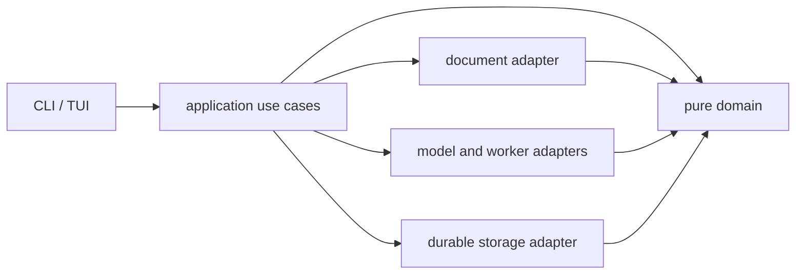
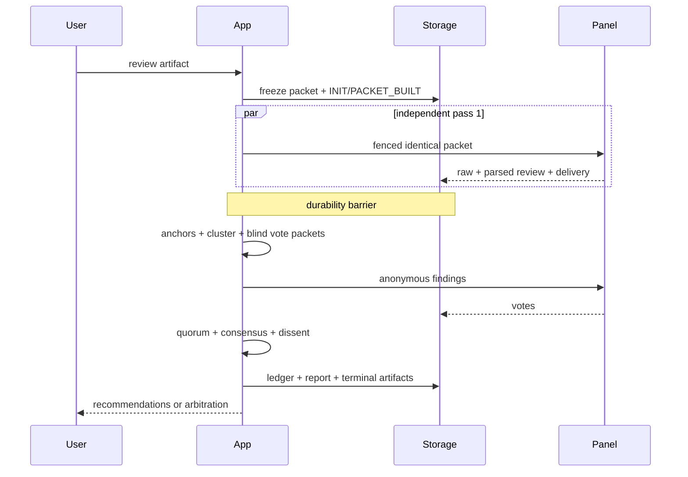

# Tribunal Architecture

## Dependency direction

The domain imports only Go standard-library value types. Interfaces parse raw
input, application code owns orchestration and barriers, and adapters translate
filesystem/network/process details.

## Review sequence

## Module contracts

| Module | Responsibility | Must not own | Allowed dependencies | Public surface |
|---|---|---|---|---|
| `domain` | Typed rules and immutable values | filesystem, network, commands, UI | stdlib | findings, panels, consensus, lifecycle |
| `app` | Use-case orchestration and barriers | raw CLI parsing, vendor argv | domain + ports | Service methods |
| `documents` | canonical packets/extraction/anchors/redaction | voting, model invocation | domain | Builder, Resolver |
| `storage` | external durable state, locks, snapshots, ledgers | review policy, UI | domain | Store |
| `adapters` | model/worker process and HTTP translation | consensus, persistence policy | domain/app ports | Registry, Adapter |
| `config` | trusted layered configuration | execution | domain | Load, ResolvePanel |
| `cli` | parse/delegate/render | domain rules, persistence | app/config | NewRootCommand |
| `tui` | read-only snapshot rendering | launch/edit logic | app snapshot port | Run |

## Extension seams

- New reviewer: implement the adapter port and add golden argv/request tests.
- New document format: implement an extractor returning typed text plus source
  hash and provenance; packet policy remains unchanged.
- New rubric/persona: provide schema-versioned data and pass lint/hash checks.
- New worker: implement the typed evidence task port and obey network policy.
- New report: consume the final domain projection; never parse raw model output.
