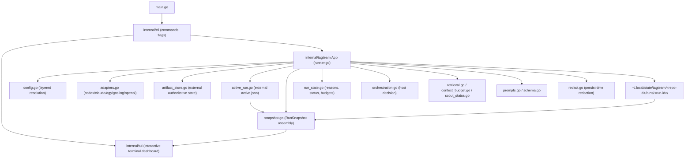
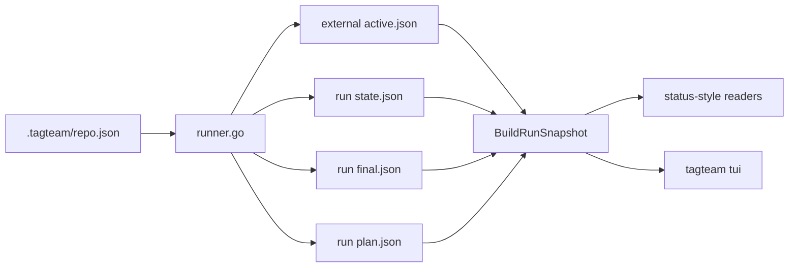
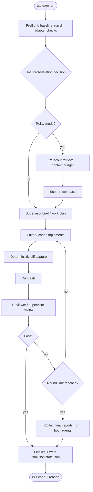
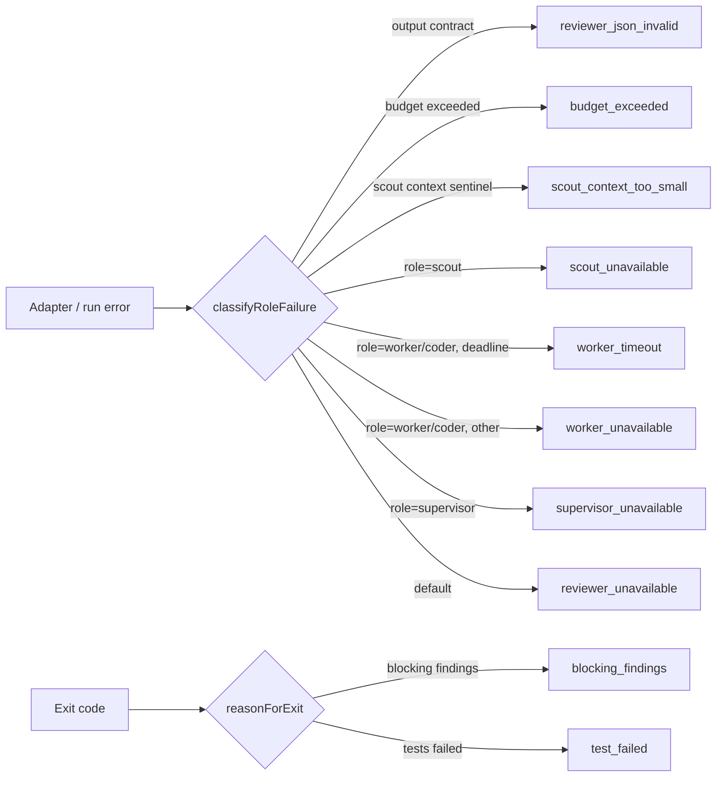
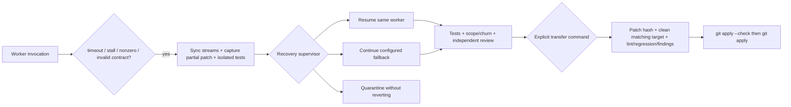

# Implementation Diagrams

Mermaid diagrams of the implemented `tagteam` architecture. Each carries an
evidence note listing the source files the diagram was derived from.

## Component map

**Evidence:** `main.go`, `internal/cli/root.go`, `internal/tagteam/runner.go`,
`internal/cli/tui.go`, `active_run.go`, `snapshot.go`, `config.go`,
`adapters.go`, `run_state.go`, `orchestration.go`, `retrieval.go`,
`context_budget.go`, `scout_status.go`, `prompts.go`, `schema.go`, `redact.go`,
`internal/tui/*.go`.

## Live status / TUI data flow

**Evidence:** `internal/tagteam/runner.go`, `active_run.go`, `snapshot.go`,
`types.go`, `internal/cli/tui.go`, `internal/tui/tui.go`.

## Reviewed-mode run loop

**Evidence:** `internal/tagteam/runner.go` (`Run`, `Review`, `runLoop`,
`collectRoundLimitReports`), `run_state.go` (`finalizeRunState`,
`classifyRoleFailure`, `reasonForExit`), `orchestration.go`.

## Failure classification → reason code

**Evidence:** `internal/tagteam/run_state.go`
(`classifyRoleFailure`, `reasonForExit`), `internal/tagteam/types.go`
(`ReasonCode`, `Exit*`), `context_budget.go` (`errScoutContextTooSmall`).

## Failed invocation recovery and transfer

**Evidence:** `internal/tagteam/recovery.go`, `invocation_stream.go`,
`timeout_calibration.go`, `quality_gates.go`, `findings.go`, `transfer.go`.

## Notes

Diagrams are intentionally simple (`flowchart TD/LR`) and do not model
unverified internals. Update them when the run loop, adapter set, or reason-code
vocabulary changes.
